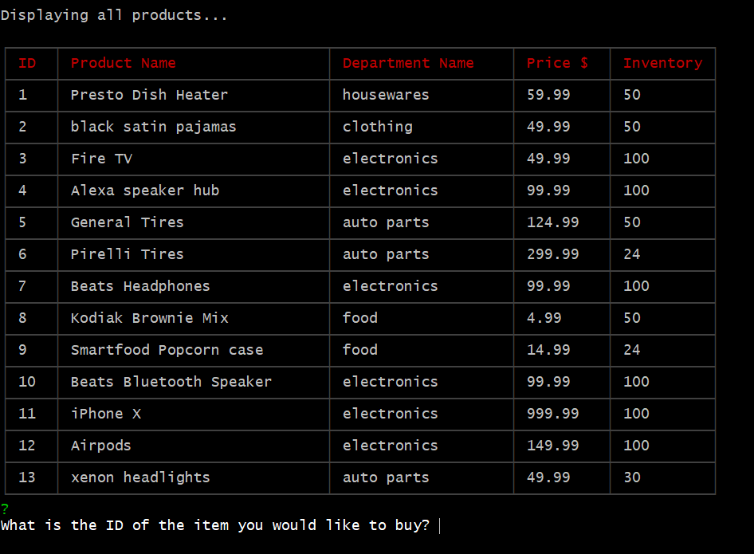

# mySQL-node-inventoryApp - what it does:
This is a CLI app that uses nodeJS and mySQL to display inventory in a mock store and make sales purchases with the total price being displayed.  There is also updating of the inventory after the purchase.

## Overview of the organization of the app and how to use it
* the coding is written in a way that the CLI interface will display a table with the products for sale.
* the user chooses an item by it's ID number and then inputs by prompts what quantity he/she wants to purchase.
* the total price is then displayed and a recursion loop is then put in if the user wants to continue shopping.
* the inventory of the products changes with the purchases.

## link to the Github repository - this app is a nodeJS app which can be run on a command line interface like Gitbash
* https://github.com/sahasra101/mySQL-node-inventoryApp

## screenshots, gifs or videos of the app functioning

Table displayed on CLI:

Example of purchase:

## Technologies used in this app:
* javascript
* nodeJS
* npm packages
* mySQL

## Javascript and nodeJS coding by Ajay Kiri with assistance from software teaching activities from the UPenn/Trilogy NodeJS Bootcamp lessons and various google searches. 